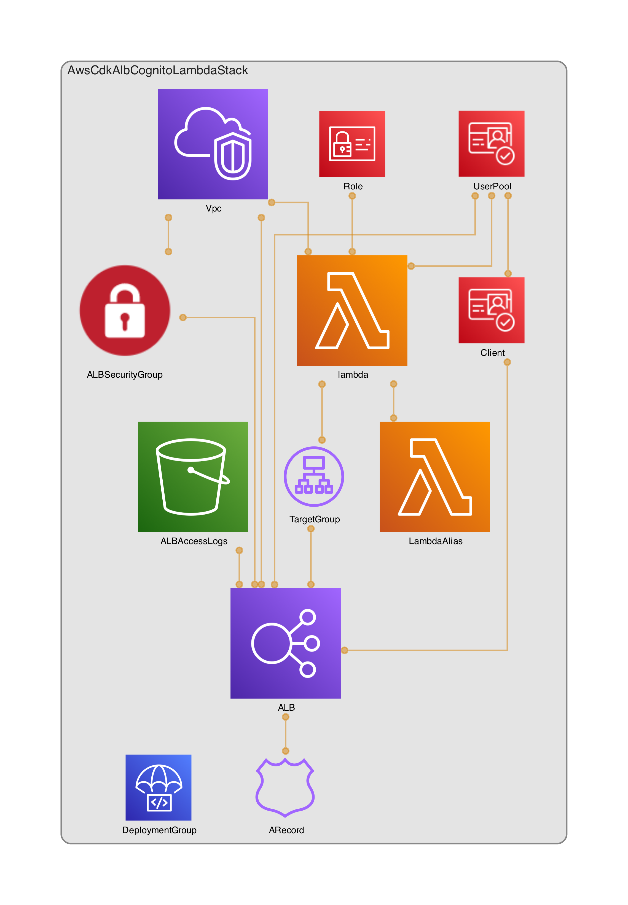

# Demo of ALB + Cognito Auth sitting in front of Lambda

## Why?

The purpose of this repo is to show a developer what Authentication headers a public AWS Application Load Balancer will pass through to a Lambda sitting behind the ALB.

## Design 

The architecture is generated through [CDK-Dia](https://github.com/pistazie/cdk-dia).



## What do you need to do?

> You'll need to provide your own domain and Certificate for the Load balancer. Prepare them manually first.

Install aws-cdk and bootsrap your account for cdk to deploy:

0. npm i aws-cdk -g 

1. cdk bootstrap 

2. npm install

3. Uncomment lines 25-27 in the ```./lib/stack.ts``` file and put your Cert and domain in there.

4. cdk synth

5. cdk deploy

## What to expect?

This stack should build a public website server from lambda through an ALB. 

You should get a return from the website domain that looks something like the image below, however it will have more authentication headers.


